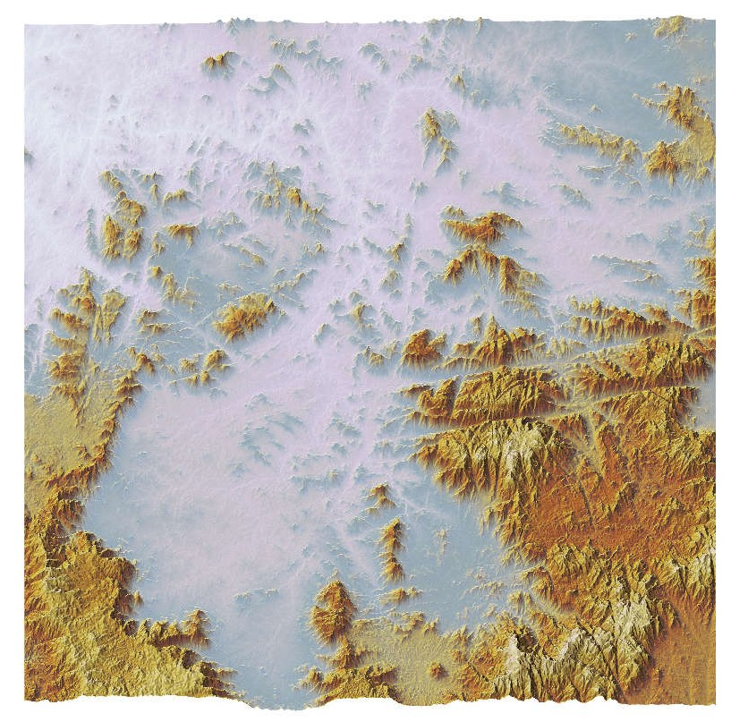
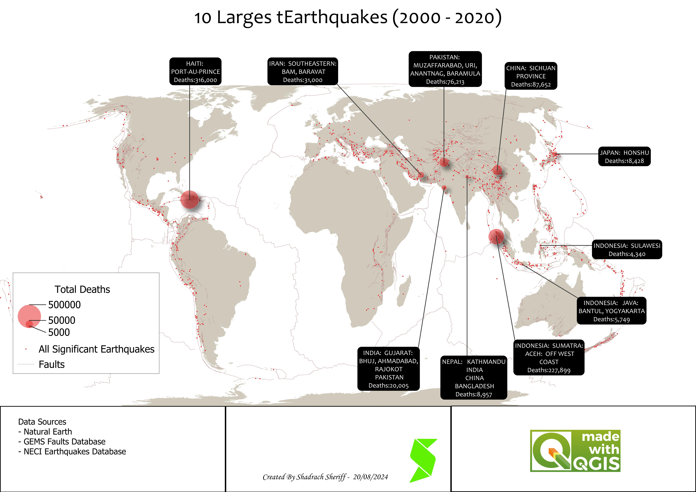
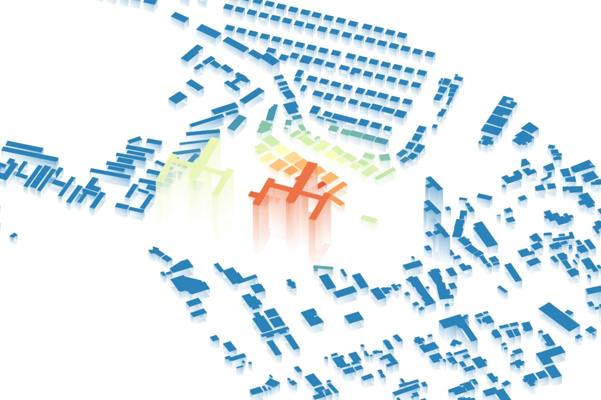

# Cartography
## Introduction
*“Everything is related to everything else, but near things are more related than distant things.” ~ Tobler’s First Law of Geography*

From personal explorations to client projects, my journey in GIS mapping has been a terrain of growth. Each map—good, bad, and everything in between—tells a story of skill, refinement, and discovery. 
Here’s a collection of my cartographic evolution, showcasing how my maps have transformed over time.

# Georeferenced

# Isometric Maps

## Spatial Analysis

## Thematic Maps

## Carto-

## Geological Maps

